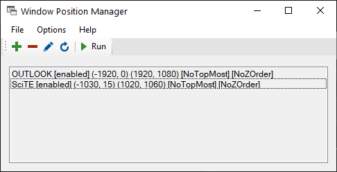

# Window Position Manager

Moves and resizes windows on your MS Windows desktop environment.

This is actually a workaround for some annoying behaviour of a Windows machine within a multi screen setup and a KVM switch with only one video port.

## Command line arguments

| arg | Description |
|---|---|
| none | enters the mode specified in the settings |
| `gui` | enters to an interactive GUI |
| `run` | just processes the jobs (hidden mode) |

## Reset

To restore the "factory defaults" delete `settings.ini`, `config.ini` and optionally `jobs.ini`

## License

GNU GPL v3

Copyright (C) 2020  Oliver Blaser

This program is free software: you can redistribute it and/or modify
it under the terms of the GNU General Public License as published by
the Free Software Foundation, either version 3 of the License, or
(at your option) any later version.

This program is distributed in the hope that it will be useful,
but WITHOUT ANY WARRANTY; without even the implied warranty of
MERCHANTABILITY or FITNESS FOR A PARTICULAR PURPOSE.  See the
GNU General Public License for more details.

You should have received a copy of the GNU General Public License
along with this program.  If not, see <https://www.gnu.org/licenses/>.
